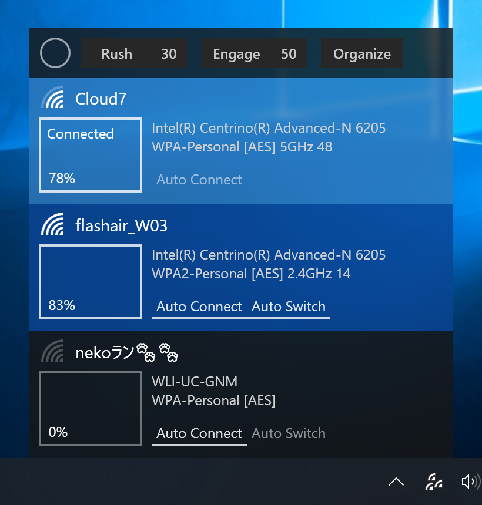
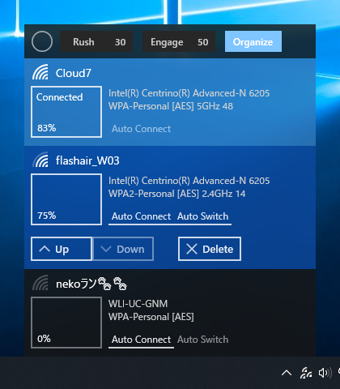

[Japanese](README_ja.md)

# Wifinian

More control over Wi-Fi connections!

Wifinian is a Windows desktop tool to enable user to actively control Wi-Fi connections.

 
(DPI: 200%)

Functions:
 * Connect to or disconnect from a wireless network
 * Rename a wireless profile
 * Change automatic connection (Auto Connect) or automatic switch (Auto Switch) settings of a wireless profile
 * __Rush__ - Perform rescan of wireless networks in short intervals (The number indicates interval (sec).)
 * __Engage__ - Execute automatic connection depending on signal strength, order and automatic switch setting of wireless profiles (The number indicates threshold of signal strength (%).)
 * __Organize__ - Change the order (priority) of wireless profiles, delete a wireless profile

 
(DPI: 100%)

## Requirements

 * Windows 7 or newer
 * .NET Framework 4.8

## Download

 * Windows 10 Anniversary Update (1607) or newer: 
[Wifinian](https://www.microsoft.com/store/apps/9pngfqps4flh) (Windows Store)

 * Other: 
:floppy_disk: [Installer](https://github.com/emoacht/Wifinian/releases/download/2.3.0-Installer/WifinianInstaller230.zip) | :floppy_disk: [Executables](https://github.com/emoacht/Wifinian/releases/download/2.3.0-Executables/Wifinian230.zip)

## Install/Uninstall

When you use only executables, please note the following:

 - The settings file will be created at: `[system drive]\Users\[user name]\AppData\Local\Wifinian\`
 - When you check [Start on sign in], a registry value will be added to: `HKEY_CURRENT_USER\Software\Microsoft\Windows\CurrentVersion\Run`

## Remarks

 - To rename a wireless profile, press and hold its name.
 - Rescan of wireless networks by OS itself is triggered by some actions and if no such actions take place, seems to be performed once per one minute.
 - Automatic connection by Engage function applies only to wireless profiles whose automatic switch are enabled. If a profile whose automatic switch is not enabled has been already connected, automatic connection will not be executed.
 - When you connect to a wireless network by OS's wireless menu, the order of wireless profiles may be automatically changed.
 - A wireless profile is associated with a specific wireless adapter and if the adapter is not in place, such profile will not be shown.

## History

:scroll: [History](HISTORY.md)

## Libraries

 - [Reactive Extensions][1]
 - [Reactive Property][2]
 - [XamlBehaviors for WPF][3]
 - [Managed Native Wifi][4]
 - [Monitorian/ScreenFrame][5]
 - [Monitorian/StartupAgency][5]
 - [Monitorian/StartupBridge][5]

[1]: https://github.com/Reactive-Extensions/Rx.NET
[2]: https://github.com/runceel/ReactiveProperty
[3]: https://github.com/microsoft/XamlBehaviorsWpf
[4]: https://github.com/emoacht/ManagedNativeWifi
[5]: https://github.com/emoacht/Monitorian

## License

 - MIT License

## Developer

 - emoacht (emotom[atmark]pobox.com)

_____

### How to delete wireless profiles from OS's GUI

The GUI to delete wireless profiles has come back in Windows 8.1 Update. To reach this GUI, see the following.

#### Windows 10

[Network settings] from notification area (or [Settings] from Start menu) &rarr; [Network & Internet] &rarr; [Wi-Fi] &rarr; [Manage WiFi Settings] &rarr; [Manage known networks]

Note: If multiple profiles of the same name exist (it will happen if you connected to the same wireless network using multiple wireless adapters because SSID of wireless network is used for a profile name), such profiles will not be differentiated and will be deleted in bulk.

#### Windows 8.1 Update

[Settings] in Charm &rarr; [Change PC settings] &rarr; [Network] &rarr; [Connections] &rarr; [Manage known networks] in [Wi-Fi]
