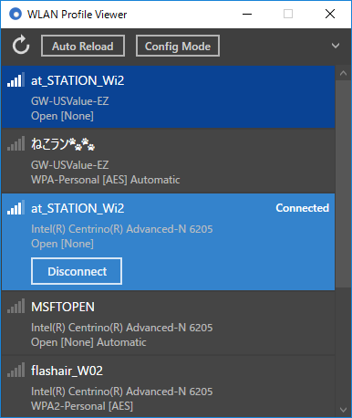
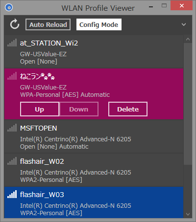

[Japanese](README_ja.md)

WLAN Profile Viewer
===================

WLAN Profile Viewer is a Windows desktop app to manage wireless LAN profiles. It can do the following:
 - Show a list of all existing wireless LAN profiles
 - Connect and disconnect to a wireless LAN
 - Change the order (priority) of wireless LAN profiles
 - Delete a wireless LAN profile

 

##Requirements

 * Windows 7 or newer
 * .NET Framework 4.5.2

##Download

[Download](https://github.com/emoacht/WlanProfileViewer/releases/download/1.0.0/WlanProfileViewer100.zip)

##Install

No installation is required.

Settings file will be saved in the following folder. 
[system drive]\Users\[user name]\AppData\WlanProfileViewer\

##Remarks

 - Each profile is associated with a specific wireless LAN adapter and so, if the adapter is removed (in the case of a USB adapter for example), such profile will not be shown.

 - Reloading requests a wireless LAN adapter to rescan wireless LANs. As a result, if it has been already connected, frequent reloading might slow down the connection speed.

 - On Windows 10, the order of profiles can be changed (except a profile receiving a signal). However, it is virtually meaningless because OS automatically changes the order depending on the situation.

 - When the order of a profile is changed, it may happen that the position of another profile will jump (especially if the authentication is open). It is done by OS itself but the clear reason is unknown.

##History

[History](History.md)

##License

 - MIT License

##Libraries

 - [Reactive Extensions][1]
 - [Reactive Property][2]
 - [WPF Monitor Aware Window][3]

[1]: https://github.com/Reactive-Extensions/Rx.NET
[2]: https://github.com/runceel/ReactiveProperty
[3]: https://github.com/emoacht/WpfMonitorAware

##Reference

###How to delete wireless LAN profiles from OS's GUI

The GUI to delete wireless LAN profiles has come back in Windows 8.1 Update. To reach this GUI, see the following.

####Windows 8.1 Update

"Settings" in Charm &rarr; "Change PC settings" &rarr; "Network" &rarr; "Connections" &rarr; "Manage known networks" in "Wi-Fi"

####Windows 10

"Network settings" from notification area (or "Settings" from Start menu) &rarr; "Network & Internet" &rarr; "Wi-Fi" &rarr; "Manage WiFi Settings" &rarr; "Manage known networks"

Note: If multiple profiles of the same name exist (it will happen if you connected to the same wireless LAN using multiple wireless LAN adapters because SSID of wireless LAN is used for a profile name), such profiles will not be differentiated and will be deleted in bulk.
