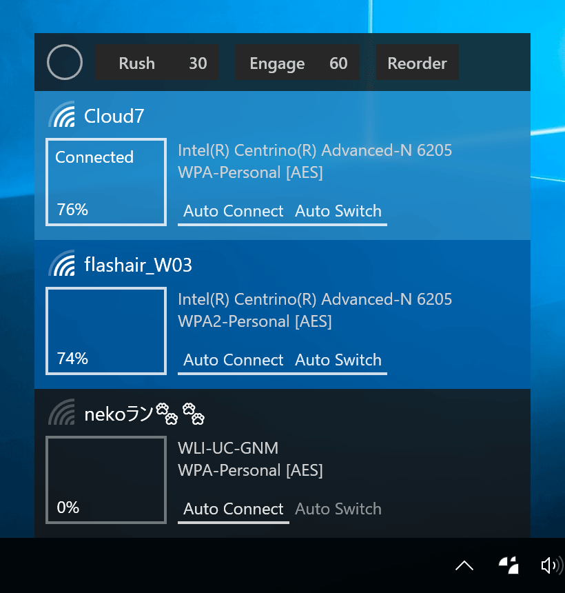

[English](README.md)

# Wifinian

Wi-Fi接続にもっとコントロールを!

WifinianはWi-Fi接続をユーザーが積極的にコントロールすることができるWindowsデスクトップツールです。

 
(DPI: 200%)

機能:
 * 無線ネットワークとの接続と切断
 * 無線プロファイルの名称の変更
 * 無線プロファイルの自動接続（Auto Connect）と自動切換（Auto Switch）設定の変更
 * __Rush__ - 短い間隔での無線ネットワークの再スキャンの実行（数字は間隔（秒）を示す）
 * __Engage__ - 無線プロファイルの電波強度、順番、自動切換設定に応じた自動接続の実行（数字は電波強度（％）の閾値を示す）
 * __Reorder__ - 無線プロファイルの順番（優先度）の変更

## 動作条件

 * Windows 7以降
 * .NET Framework 4.6.2

## ダウンロード

:floppy_disk: [インストーラー](https://github.com/emoacht/Wifinian/releases/download/2.1.0-Installer/WifinianInstaller210.zip) | :floppy_disk: [実行ファイル](https://github.com/emoacht/Wifinian/releases/download/2.1.0-Executables/Wifinian210.zip)

## インストール/アンインストール

実行ファイルだけを使うときは、以下に留意してください。

 - 設定ファイルは次の場所に作成されます: `[system drive]\Users\[user name]\AppData\Local\Wifinian\`
 - [サインイン時に起動する]にチェックしたときは、レジストリ値が次の位置に追加されます: `HKEY_CURRENT_USER\Software\Microsoft\Windows\CurrentVersion\Run`

## 特記事項

 - 無線プロファイルの名称を変更するには、名称を長押ししてください。
 - 無線ネットワークのOS自身による再スキャンは、幾つかのアクションに応じて行われるほか、そのようなアクションがない場合は、1分ごとに行われるようです。
 - Engage機能の自動接続は、自動切換が有効である無線プロファイルだけが対象です。自動切換が有効でない無線プロファイルが接続済みのときは、自動接続は行われません。
 - OSの無線メニューから接続すると、無線プロファイルの順番が自動的に変更されることがあります。
 - 無線プロファイルは特定の無線アダプターに関連付けられているので、そのアダプターが取り外されているときは表示されません。

## 履歴

[History](HISTORY.md)

## ライブラリ

 - [Reactive Extensions][1]
 - [Reactive Property][2]
 - [Managed Native Wifi][3]
 - [Monitorian/ScreenFrame][4]
 - [Monitorian/StartupAgency][4]
 - [Monitorian/StartupBridge][4]

[1]: https://github.com/Reactive-Extensions/Rx.NET
[2]: https://github.com/runceel/ReactiveProperty
[3]: https://github.com/emoacht/ManagedNativeWifi
[4]: https://github.com/emoacht/Monitorian

## ライセンス

 - MIT License

## 開発者

 - emoacht (emotom[atmark]pobox.com)

_____

### 無線プロファイルをOSのGUIから削除する方法

無線プロファイルを削除するためのGUIがWindows 8.1 Updateから復活しました。このGUIに辿り着くには以下を見てください。

#### Windows 10

通知領域から[ネットワーク設定]（またはスタートメニューから[設定]）&rarr; [ネットワークとインターネット] &rarr; [Wi-Fi] &rarr; [Wi-Fi設定を管理する] &rarr; [既知のネットワークの管理]

注意: 同名のプロファイルが複数ある場合（プロファイル名には無線ネットワークのSSIDが使われるので、同じ無線ネットワークに複数の無線アダプターで接続した場合に起こる）、これらは区別されず、まとめて削除されます。

#### Windows 8.1 Update

チャームの[設定] &rarr; [PC設定の変更] &rarr; [ネットワーク] &rarr; [接続] &rarr; [Wi-Fi]の[既知のネットワークの管理]
